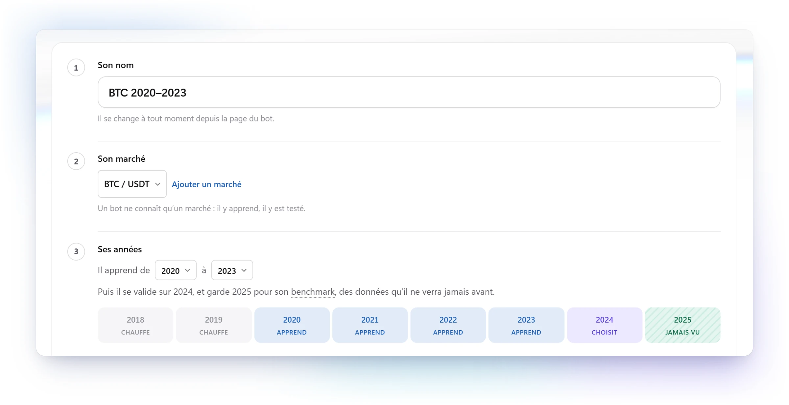
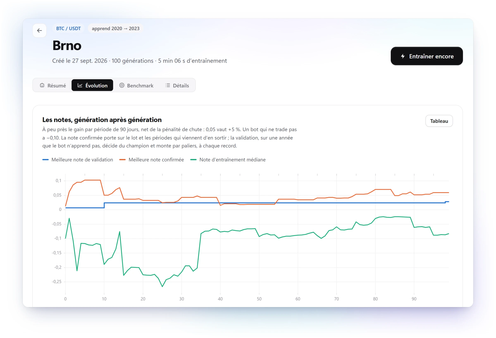
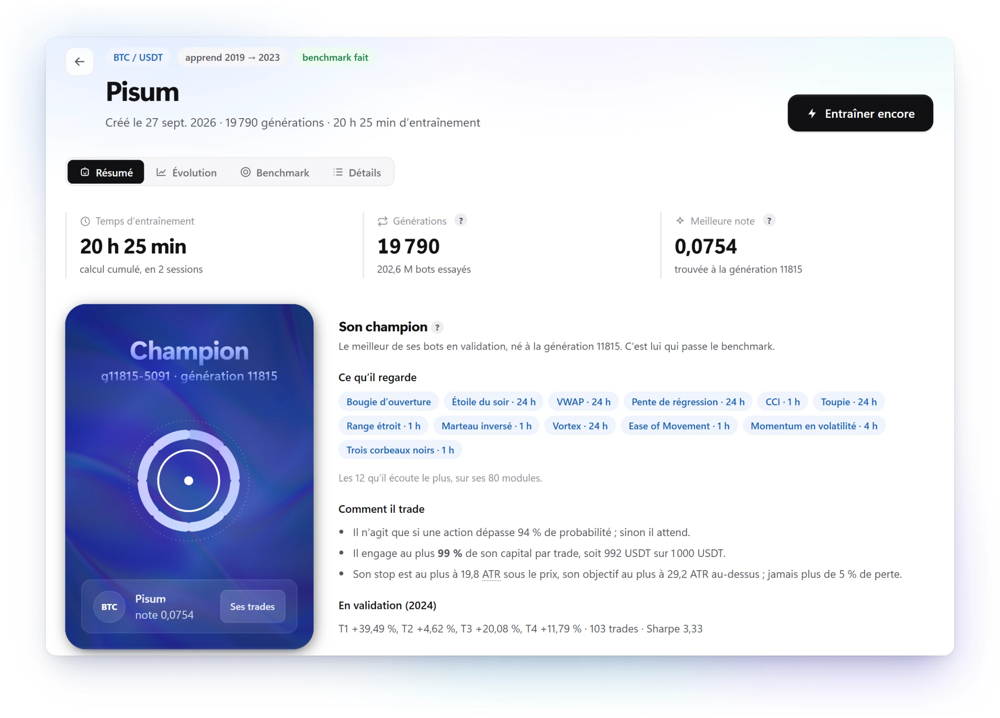
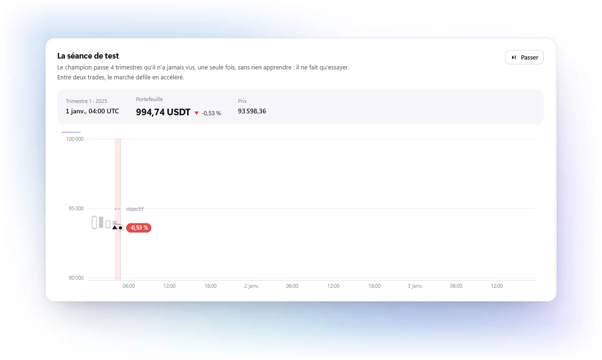
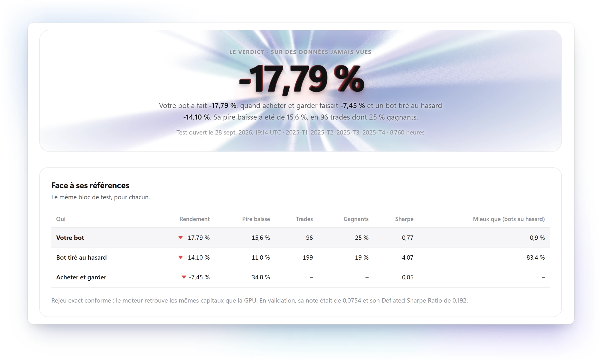
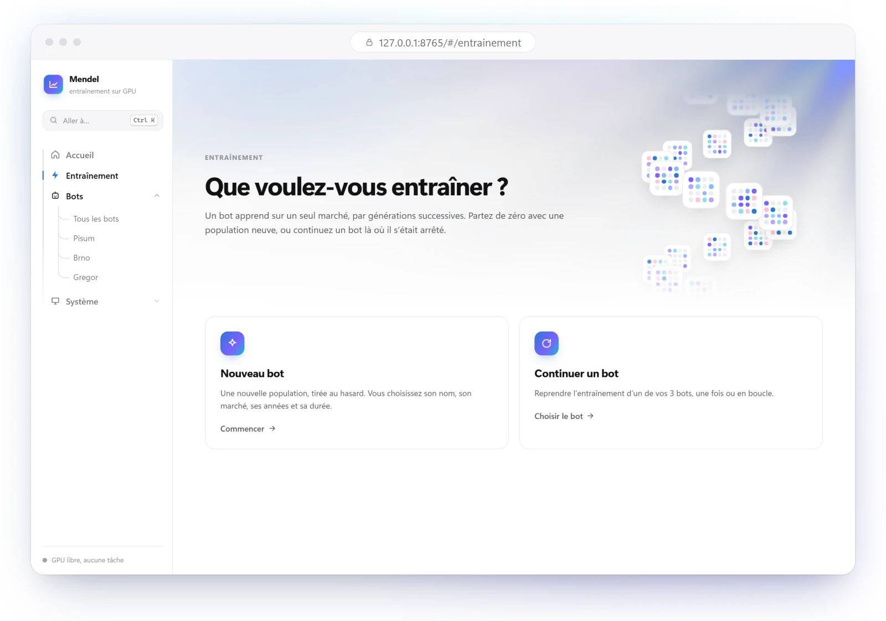
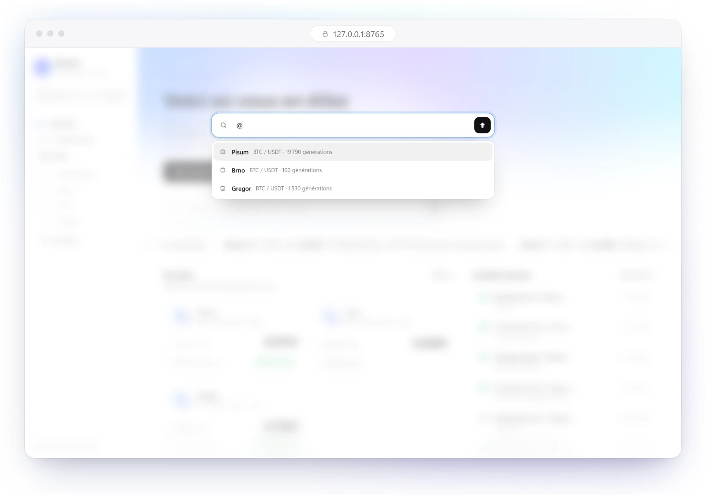
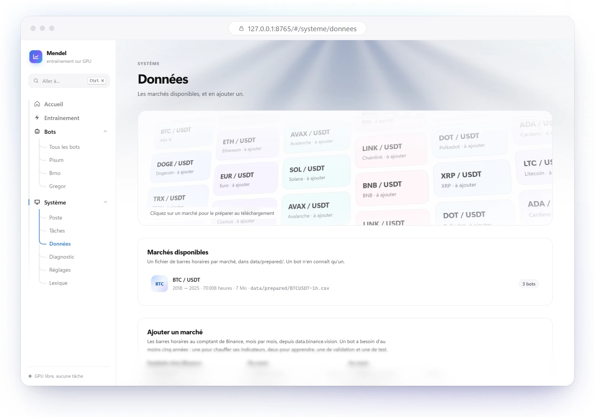
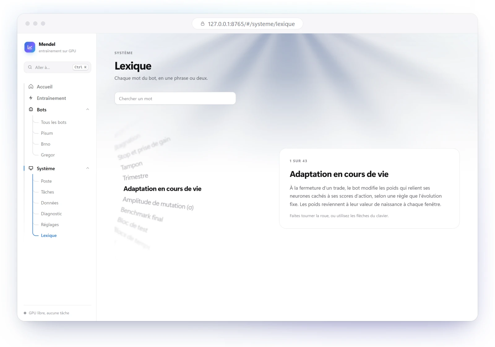
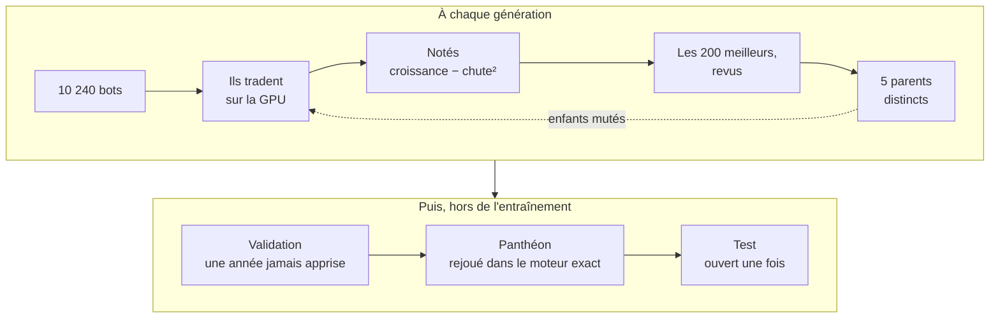

<p align="center">
  
</p>

<p align="center">
  <b>Dix mille bots de trading naissent sur votre carte graphique.</b><br>
  Ils tradent, on les note, et les meilleurs ont des enfants.<br>
  Aucun de leurs chiffres n'est cru avant qu'un moteur exact l'ait rejoué.
</p>

<p align="center">
  <a href="#démarrer-en-un-double-clic">Démarrer</a> ·
  <a href="#la-vie-dun-bot">La vie d'un bot</a> ·
  <a href="#sous-le-capot">Sous le capot</a> ·
  <a href="#en-ligne-de-commande">En ligne de commande</a> ·
  <a href="README.md">English</a>
</p>

<br>

<table align="center">
  <tr>
    <td align="center" width="25%"><h3>10&nbsp;240</h3>bots<br>par génération</td>
    <td align="center" width="25%"><h3>≈&nbsp;3&nbsp;s</h3>par génération,<br>sur la GPU de 4 Go d'un portable</td>
    <td align="center" width="25%"><h3>8&nbsp;050</h3>gènes<br>par bot</td>
    <td align="center" width="25%"><h3>1</h3>regard sur l'année de test,<br>pas un de plus</td>
  </tr>
</table>

## La vie d'un bot

Chaque bot de Mendel vit les cinq mêmes chapitres.<br>
Les écrans ci-dessous viennent de vrais runs, sur le Bitcoin, heure par heure.

### ① La naissance

Un nom, un marché, ses années : c'est tout.<br>
Mendel tire une population de 10&nbsp;240 bots au hasard.<br>
Les années se répartissent d'elles-mêmes : deux pour chauffer les indicateurs, celles où il apprend,<br>
une année pour choisir son champion, et une qu'il ne verra qu'à la toute fin.

<p align="center">
  
</p>

### ② L'évolution

À chaque génération, chaque bot trade quatre fenêtres de 90 jours sur la GPU, frais et glissement compris.<br>
Sa note est la croissance de son capital, moins le carré de sa pire chute,<br>
rabattue tant que des trades en nombre ne l'ont pas prouvée.<br>
Les 200 meilleurs doivent aussi tenir sur les périodes qui viennent de quitter le lot. Cinq parents distincts restent, et leurs enfants mutent.

<p align="center">
  
</p>

### ③ Le champion

Les cinq meilleures notes sur l'année de validation forment le Panthéon.<br>
Avant qu'un bot y entre, le moteur exact rejoue chacun de ses ordres, en décimal, et doit retrouver le même capital.<br>
La page du bot dit ce que regarde son champion, comment il trade, et ce qu'il a fait.

<p align="center">
  
</p>

### ④ L'épreuve

L'année de test ne s'ouvre qu'une fois. Son dossier devient alors un verrou.<br>
Le champion la trade sans rien apprendre, à côté d'un bot tiré au hasard et de l'achat conservé.<br>
On la regarde comme un film : le marché défile en accéléré entre deux trades, et chaque trade se joue jusqu'à sa sortie.

<p align="center">
  
</p>

### ⑤ Le verdict

Puis viennent les chiffres, sans rien cacher.<br>
Le champion de ces écrans a gagné 39&nbsp;%, 5&nbsp;%, 20&nbsp;% et 12&nbsp;% sur les quatre trimestres de 2024.<br>
Sur l'année 2025, qu'il n'avait jamais vue, il a perdu 17,8&nbsp;% : moins bien que garder ses bitcoins, et moins bien qu'un bot tiré au hasard.<br>
C'est exactement à cela que sert un test.

<p align="center">
  
</p>

## Autour des bots

<table>
  <tr>
    <td width="50%"></td>
    <td width="50%"></td>
  </tr>
  <tr>
    <td><b>Entraînez</b> une population neuve, ou continuez un bot là où il s'est arrêté, une fois ou en boucle.</td>
    <td><b>Ctrl+K</b> mène partout : <code>/</code> pour une action, <code>@</code> pour un bot, ou n'importe quel mot.</td>
  </tr>
  <tr>
    <td width="50%"></td>
    <td width="50%"></td>
  </tr>
  <tr>
    <td><b>Les marchés</b> viennent de Binance, heure par heure, et s'ajoutent depuis l'application.</td>
    <td><b>Un lexique</b> de 43 mots. Chaque terme souligné en pointillé se définit au survol.</td>
  </tr>
</table>

Chaque tâche tourne dans sa propre console cachée. Fermez l'interface : l'entraînement continue, et l'interface le retrouve.<br>
L'arrêt envoie un vrai Ctrl+C : le bot finit sa génération et écrit un point de sauvegarde.

## Démarrer en un double-clic

```powershell
git clone https://github.com/jedreety/Mendel.git
```

Puis double-cliquez sur **`demarrer.cmd`**.<br>
Il prépare ce qui manque, puis ouvre l'interface dans votre navigateur.

| Étape | Ce qui se passe |
|---|---|
| Python | De la 3.11 à la 3.15. S'il n'en trouve pas, il propose d'installer Python 3.13 par winget. |
| PyTorch | Dans `.venv`, dans la variante qu'il faut à la machine : CUDA 13.0, la référence, pour une RTX 20 ou plus récente avec un pilote 580 ou plus ; CUDA 12.6 pour une carte ou un pilote plus anciens ; sans CUDA s'il n'y a pas de GPU NVIDIA. |
| L'application | Livrée déjà construite. Node.js ne sert que si vous modifiez `interface/web`. |
| Un marché | BTCUSDT, heure par heure, de 2018 à 2025, depuis data.binance.vision. Une fois, en quelques minutes. |
| L'interface | <http://127.0.0.1:8765>. Elle n'écoute que votre machine. |

Les lancements suivants prennent une seconde ou deux. Les arguments vont au serveur : `demarrer.cmd --port 8800`.

**Il faut** Windows 10 ou 11 (64 bits), et une GPU NVIDIA pour entraîner : 4 Go suffisent.<br>
Sans elle, l'interface s'ouvre quand même, et le moteur exact fait toujours ses backtests.<br>
Gardez le dossier près de la racine du disque (100 caractères au plus), sauf si les chemins longs de Windows sont activés.

**Bon à savoir**

- Un entraînement occupe environ 1,8 Go sur la carte. Fermez ce qui la charge, comme un fond d'écran animé ou un jeu : sinon Windows déborde vers la mémoire partagée, et une génération peut prendre cent fois plus.
- Un entraînement met une trentaine de secondes à démarrer, le temps de préparer les tables de ses règles. Ses noyaux CUDA se compilent au premier usage, puis attendent dans `%TEMP%\tradingbot-noyaux`, que l'on peut effacer à tout moment.
- Les rejeux exacts du Panthéon tournent dans des processus à part, en priorité basse, pendant que les générations suivantes avancent.

> [!NOTE]
> Avec Smart App Control, Windows peut refuser une des DLL non signées de PyTorch (`WinError 4551`).<br>
> L'interface s'ouvre quand même, et sa page Diagnostic montre le refus.

## Sous le capot

### Une génération



### Contre la chance

Avec dix mille bots et huit mille gènes, il y a toujours un bot qui a l'air brillant.<br>
Mendel est construit pour que la chance doive passer tout ceci.

| Piège | Ce que fait Mendel |
|---|---|
| Apprendre le passé par cœur | Entraînement, validation et test sont des blocs séparés, avec un mois tampon entre eux. L'entraînement ne charge jamais le test. |
| Un bot chanceux parmi des milliers | Un gain est rabattu tant que des trades en nombre ne l'appuient pas. Le Deflated Sharpe Ratio compte chaque essai. |
| Voir des motifs dans le bruit | Un run à blanc évolue sur des prix mélangés, et une recherche au hasard a le même budget. Les deux fixent la barre à battre. |
| Des exécutions flatteuses | Le stop se teste au plus bas, il l'emporte sur l'objectif touché dans la même barre, frais et glissement jouent toujours contre le bot. |
| Des décimales qui dérivent | La GPU compte l'argent en entiers exacts de 64 bits, le moteur en décimal. Chaque membre du Panthéon est rejoué. |
| Des résultats que personne ne refait | Même configuration, même graine, mêmes fichiers. Un run repris redonne ceux d'un run continu. |

### Deux moteurs, une vérité

**Le simulateur GPU** est un seul noyau CUDA, compilé au lancement par NVRTC, livré avec PyTorch : pas de CUDA Toolkit.<br>
Chaque bot est un réseau récurrent de 64 neurones. Ses 26 entrées sont 8 canaux qui résument 80 modules de signal, et 18 valeurs de son propre état.<br>
Il décide d'acheter, de vendre ou d'attendre, de la taille de la position, de son stop, de son objectif et de sa durée maximale.<br>
Il s'adapte aussi au fil de sa vie, après chaque trade, mais ses enfants n'héritent que de ses poids de naissance.

**Le moteur exact** est une fonction de décision pure, sur une vue figée du marché, en décimal, avec une ligne de journal par barre.<br>
Il backteste des stratégies assemblées à partir de 73 règles d'entrée, 13 règles de risque, 9 modules de sortie et 3 dimensionneurs.<br>
Il est aussi l'arbitre de chaque chiffre que produit la GPU.

### Le dépôt

| Dossier | Contenu |
|---|---|
| `engine/` | Le moteur exact : types du domaine, interfaces, décision, passe par barre, grand livre, journal. |
| `modules/` | Les briques : règles d'entrée, interpréteurs, règles de risque, sorties, dimensionneurs. |
| `input/` | Les stratégies, en déclarations seulement. |
| `adapters/` | Les fichiers de données, le courtier simulé, l'horloge. |
| `evolution/` | L'entraînement évolutif, ses noyaux CUDA, le vérificateur et le benchmark. |
| `interface/` | Le serveur local, en bibliothèque standard seulement, et son application React. |
| `scripts/` | Le téléchargement depuis Binance, et les mesures des règles et des échelles de temps. |

## En ligne de commande

Tout ce que fait l'interface est une commande que vous pouvez lancer vous-même, depuis la racine du dépôt, avec `.venv\Scripts\python`.

**Entraîner**

```powershell
# Un nouveau bot, réglé par evolution/config.toml, où chaque paramètre est écrit
python -m evolution.run

# La même chose, avec une autre configuration
python -m evolution.run --config autre.toml

# Reprend au dernier point de sauvegarde ; --generations-max 0 --stagnation-max 0 lève toute limite
python -m evolution.run --reprendre runs/<run>
```

Ctrl+C arrête un entraînement à la fin de sa génération, après un point de sauvegarde. Un second Ctrl+C l'arrête sur-le-champ.

**Tester**

```powershell
# Le run à blanc, sur des prix mélangés
python -m evolution.run --a-blanc runs/<run>

# La recherche au hasard, à budget égal
python -m evolution.run --hasard runs/<run>

# Ouvre le bloc de test, une fois ; --sans-a-blanc l'ouvre sans run à blanc, comme l'interface
python -m evolution.benchmark runs/<run> --a-blanc runs/<a-blanc>

# Vérifie les noyaux CUDA face à leurs références PyTorch et au moteur exact
python -m evolution.verifier
```

**Backtester, et les données**

```powershell
# Un backtest dans le moteur exact
python run.py input/trend.py data/prepared/BTCUSDT-1h.csv --patience 1 --capital 1000

# Télécharge et prépare un marché, mois complets seulement
python -m scripts.fetch_binance BTCUSDT 1h 2018-01 2025-12

# Combien chaque règle vote, et quelles règles s'accordent trop souvent
python -m scripts.measure_rules input/catalog.py data/prepared/BTCUSDT-1h.csv

# Le mouvement médian d'une barre, face au coût d'un aller-retour
python -m scripts.measure_timeframes data/prepared/BTCUSDT-1h.csv
```

**Où vont les choses**

- **Un entraînement** vit dans `runs/<date>-evolution/` : `manifest.json`, `config.toml`, `generations.jsonl`, le point de sauvegarde `etat.json`, `pantheon.json`, et le Panthéon rejoué trimestre par trimestre (`journal.jsonl`, `trades.csv`, `summary.json`, `reseau.jsonl`). Tout se lit sans PyTorch. Un dossier `benchmark/` signifie que le test a été ouvert.
- **Un backtest** écrit `manifest.json` (stratégie, empreinte des données, révision git), `journal.jsonl` (une ligne par barre, même sans action), `trades.csv`, et `summary.json`, qui vérifie que le capital final vaut le capital initial plus les résultats nets. Deux backtests se comparent par `git diff --no-index runs/A/summary.json runs/B/summary.json`. Les contraintes du lieu d'exécution sont dans `VENUE`, en tête de `run.py`.
- **Un marché** est un fichier de `data/prepared/`, nommé `SYMBOLE-1h.csv`, d'en-tête `time,open,high,low,close,volume`, où `time` est la clôture, en UTC.
- **L'application web** se recharge à chaque modification avec `python -m interface.serveur`, puis `npm run dev` dans `interface\web`, sur <http://localhost:5173>. `demarrer.cmd` reconstruit l'application livrée dès que ses sources changent : commitez `interface/web/dist` avec elles.

## Avant de trader

Mendel est un logiciel de recherche. Il n'est encore relié à aucune plateforme réelle : il entraîne, teste et rejoue, il ne trade pas.<br>
Un résultat, même sur des données qu'un bot n'a jamais vues, ne promet rien du suivant.<br>
Rien ici n'est un conseil financier.

## Licence

[MIT](LICENSE).
