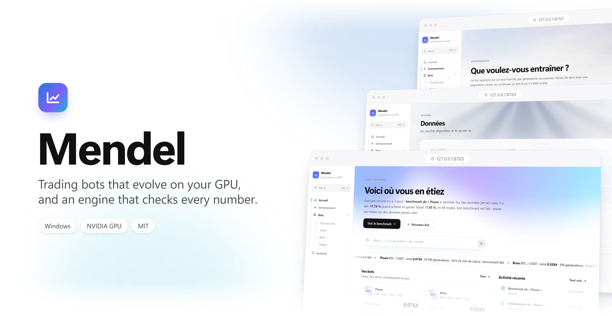
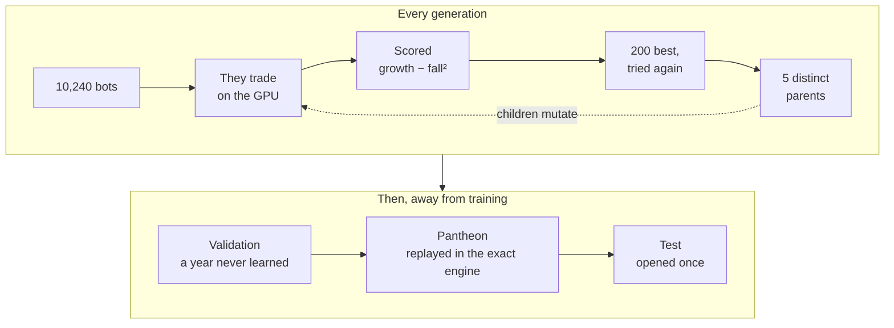

<p align="center">
  
</p>

<p align="center">
  <b>Ten thousand trading bots are born on your graphics card.</b><br>
  They trade, they are scored, and the best have children.<br>
  None of their numbers is believed until an exact engine has replayed it.
</p>

<p align="center">
  <a href="#start-in-one-double-click">Start</a> ·
  <a href="#the-life-of-a-bot">The life of a bot</a> ·
  <a href="#under-the-hood">Under the hood</a> ·
  <a href="#command-line">Command line</a> ·
  <a href="README.fr.md">Français</a>
</p>

<br>

<table align="center">
  <tr>
    <td align="center" width="25%"><h3>10,240</h3>bots<br>per generation</td>
    <td align="center" width="25%"><h3>≈ 3 s</h3>per generation,<br>on a 4 GB laptop GPU</td>
    <td align="center" width="25%"><h3>8,050</h3>genes<br>per bot</td>
    <td align="center" width="25%"><h3>1</h3>look at the test year,<br>and only one</td>
  </tr>
</table>

## The life of a bot

Every bot in Mendel lives the same five chapters.<br>
The screens below come from real runs, on Bitcoin, hour by hour.

### ① Birth

Give it a name, a market and its years. That is all.<br>
Mendel draws a population of 10,240 random bots.<br>
The years split on their own: two to warm up the indicators, the years it learns from,<br>
one year to pick its champion, and one year it will only see at the very end.

<p align="center">
  
</p>

### ② Evolution

Every generation, each bot trades four 90-day windows on the GPU, fees and slippage included.<br>
Its score is the growth of its capital, minus the square of its worst fall,<br>
shrunk until enough trades prove it.<br>
The 200 best must also hold on the periods that just left the batch. Five distinct parents remain, and their children mutate.

<p align="center">
  
</p>

### ③ The champion

The five best scores on the validation year form the Pantheon.<br>
Before a bot enters it, the exact engine replays every one of its orders, in Decimal, and must find the same capital.<br>
The bot's page tells what its champion watches, how it trades, and how it did.

<p align="center">
  
</p>

### ④ The test

The test year opens once. Its folder then becomes a lock.<br>
The champion trades it without learning anything, next to a random bot and to buy-and-hold.<br>
You watch it like a film: the market fast-forwards between trades, and each trade plays out to its exit.

<p align="center">
  
</p>

### ⑤ The verdict

Then come the numbers, with nothing hidden.<br>
The champion on these screens gained 39 %, 5 %, 20 % and 12 % over the four quarters of 2024.<br>
On 2025, which it had never seen, it lost 17.8 %: worse than holding Bitcoin, and worse than a random bot.<br>
That is exactly what a test is for.

<p align="center">
  
</p>

## Around the bots

<table>
  <tr>
    <td width="50%"></td>
    <td width="50%"></td>
  </tr>
  <tr>
    <td><b>Train</b> a new population, or continue a bot where it stopped, once or in a loop.</td>
    <td><b>Ctrl+K</b> goes anywhere: <code>/</code> for an action, <code>@</code> for a bot, or any word.</td>
  </tr>
  <tr>
    <td width="50%"></td>
    <td width="50%"></td>
  </tr>
  <tr>
    <td><b>Markets</b> come from Binance, hour by hour, and are added from the app.</td>
    <td><b>A lexicon</b> of 43 words. Every dotted term in the app explains itself on hover.</td>
  </tr>
</table>

Each task runs in its own hidden console. Close the interface: training goes on, and the interface finds it again.<br>
Stopping sends a real Ctrl+C: the bot finishes its generation and saves a checkpoint.<br>
The app is in French.

## Start in one double-click

```powershell
git clone https://github.com/jedreety/Mendel.git
```

Then double-click **`demarrer.cmd`** (*démarrer* means start).<br>
It prepares whatever is missing, then opens the interface in your browser.

| Step | What happens |
|---|---|
| Python | 3.11 to 3.15. If none is found, it offers to install Python 3.13 with winget. |
| PyTorch | In `.venv`, in the variant your machine needs: CUDA 13.0, the reference, for an RTX 20 or newer with driver 580 or later; CUDA 12.6 for older cards or drivers; no CUDA without an NVIDIA GPU. |
| The app | Ships already built. Node.js is only needed if you change `interface/web`. |
| A market | BTCUSDT, hourly, from 2018 to 2025, from data.binance.vision. Once, in a few minutes. |
| The interface | <http://127.0.0.1:8765>. It listens on your machine only. |

The next launches take a second or two. Arguments go to the server: `demarrer.cmd --port 8800`.

**You need** Windows 10 or 11 (64-bit) and an NVIDIA GPU to train: 4 GB is enough.<br>
Without one, the interface still opens, and the exact engine still runs backtests.<br>
Keep the folder close to the root of the drive (100 characters at most) unless Windows long paths are on.

**Good to know**

- A training takes about 1.8 GB on the card. Close what else uses it, like an animated wallpaper or a game: otherwise Windows spills into shared memory, and a generation can take a hundred times longer.
- A training needs about thirty seconds to start, the time to prepare the tables of its rules. Its CUDA kernels compile on first use, then wait in `%TEMP%\tradingbot-noyaux`, which you can delete at any time.
- The exact replays of the Pantheon run in separate processes, at low priority, while the next generations go on.

> [!NOTE]
> With Smart App Control on, Windows may refuse one of PyTorch's unsigned DLLs (`WinError 4551`).<br>
> The interface still opens, and its Diagnostic page shows the refusal.

## Under the hood

### One generation



### Guarding against luck

With ten thousand bots and eight thousand genes, some bot always looks brilliant.<br>
Mendel is built so that luck has to get through all of this.

| Trap | What Mendel does |
|---|---|
| Learning the past by heart | Training, validation and test are separate blocks, with a buffer month between them. Training never loads the test. |
| One lucky bot among thousands | A gain is shrunk until enough trades back it. The Deflated Sharpe Ratio counts every attempt. |
| Finding patterns in noise | A shadow run evolves on shuffled prices, and a random search gets the same budget. Both set the bar to beat. |
| Flattering fills | Stops are tested at the low, a stop wins any tie with the target, fees and slippage always go against the bot. |
| Drifting decimals | The GPU counts money in exact 64-bit integers, the engine in Decimal. Every Pantheon member is replayed. |
| Results nobody can reproduce | Same configuration, same seed, same files. A resumed run gives the files of a continuous one. |

### Two engines, one truth

**The GPU simulator** is a single fused CUDA kernel, compiled at launch by NVRTC, which ships with PyTorch: no CUDA Toolkit.<br>
Each bot is a recurrent network of 64 neurons. Its 26 inputs are 8 channels summing up 80 signal modules, and 18 values of its own state.<br>
It outputs buy, sell or hold, the size of the position, its stop, its target and its maximum duration.<br>
It also adapts during its life after each trade, but its children inherit only its weights at birth.

**The exact engine** is a pure decision function over a frozen view of the market, in Decimal, with one journal line per bar.<br>
It backtests strategies assembled from 73 entry rules, 13 risk rules, 9 exit modules and 3 position sizers.<br>
It is also the referee of every number the GPU produces.

### The repository

| Folder | Holds |
|---|---|
| `engine/` | The exact engine: domain types, interfaces, decision, pipeline, ledger, journal. |
| `modules/` | The bricks: entry rules, aggregators, risk rules, exits, sizers. |
| `input/` | Strategies, as declarations only. |
| `adapters/` | Data files, the simulated broker, the clock. |
| `evolution/` | The evolutionary training, its CUDA kernels, the verifier and the benchmark. |
| `interface/` | The local server, in the standard library only, and its React app. |
| `scripts/` | The Binance download, and measurements of rules and timeframes. |

## Command line

Everything the interface does is a command you can run yourself, from the repository root, with `.venv\Scripts\python`.

**Train**

```powershell
# A new bot, configured by evolution/config.toml, where every parameter is written
python -m evolution.run

# The same, with another configuration
python -m evolution.run --config my.toml

# Resume from the last checkpoint; add --generations-max 0 --stagnation-max 0 to remove every limit
python -m evolution.run --reprendre runs/<run>
```

Ctrl+C stops a training at the end of its generation, after a checkpoint. A second Ctrl+C stops at once.

**Test**

```powershell
# The shadow run, on shuffled prices
python -m evolution.run --a-blanc runs/<run>

# The random search, with the same budget
python -m evolution.run --hasard runs/<run>

# Opens the test block, once; --sans-a-blanc opens it without a shadow run, as the interface does
python -m evolution.benchmark runs/<run> --a-blanc runs/<shadow>

# Checks the CUDA kernels against their PyTorch references and against the exact engine
python -m evolution.verifier
```

**Backtest and data**

```powershell
# A backtest in the exact engine
python run.py input/trend.py data/prepared/BTCUSDT-1h.csv --patience 1 --capital 1000

# Downloads and prepares a market, complete months only
python -m scripts.fetch_binance BTCUSDT 1h 2018-01 2025-12

# How often each rule votes, and which rules agree too often
python -m scripts.measure_rules input/catalog.py data/prepared/BTCUSDT-1h.csv

# The median move of a bar, against the cost of a round trip
python -m scripts.measure_timeframes data/prepared/BTCUSDT-1h.csv
```

**Where things go**

- **A training** lives in `runs/<date>-evolution/`: `manifest.json`, `config.toml`, `generations.jsonl`, the checkpoint `etat.json`, `pantheon.json`, and the Pantheon replayed quarter by quarter (`journal.jsonl`, `trades.csv`, `summary.json`, `reseau.jsonl`). All of it reads without PyTorch. A `benchmark/` folder means the test has been opened.
- **A backtest** writes `manifest.json` (strategy, data fingerprint, git revision), `journal.jsonl` (one line per bar, even when nothing happens), `trades.csv`, and `summary.json`, which checks that final capital equals initial capital plus net results. Compare two with `git diff --no-index runs/A/summary.json runs/B/summary.json`. The venue's constraints sit in `VENUE`, at the top of `run.py`.
- **A market** is a file of `data/prepared/`, named `SYMBOL-1h.csv`, with the header `time,open,high,low,close,volume`, `time` being the close, in UTC.
- **The web app** reloads live with `python -m interface.serveur`, then `npm run dev` in `interface\web`, on <http://localhost:5173>. `demarrer.cmd` rebuilds the shipped app once its sources change: commit `interface/web/dist` with them.

## Before you trade

Mendel is research software. It has no connection to a real exchange yet: it trains, tests and replays, it does not trade.<br>
A result, even on data a bot has never seen, promises nothing about the next one.<br>
Nothing here is financial advice.

## License

[MIT](LICENSE).
